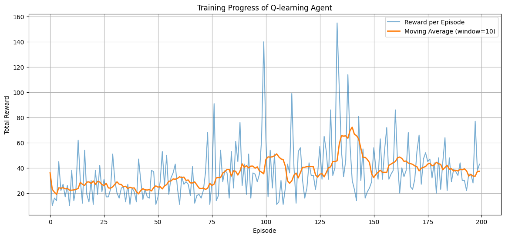
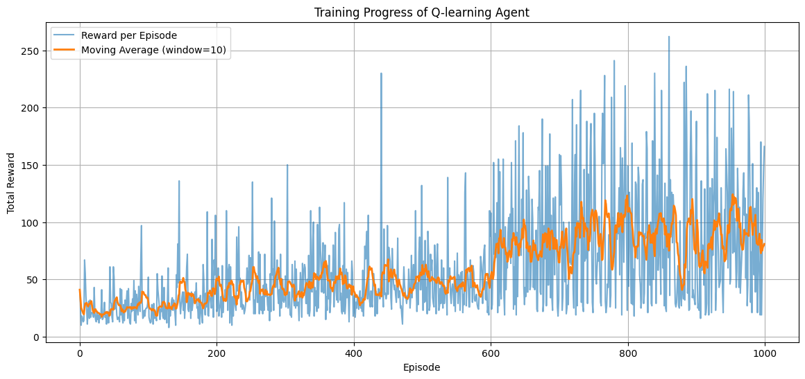
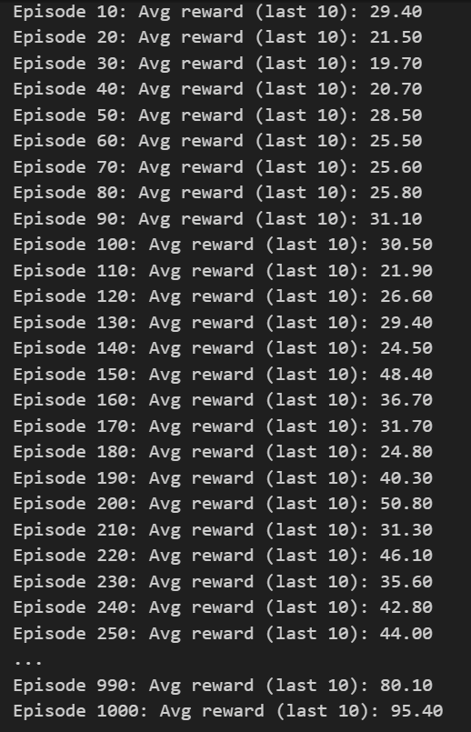

# Agent-Training-using-Q-learning
> Train an agent using **Q-learning** to balance a pole on a moving cart in the `CartPole-v1` environment (via Gymnasium). The agent learns to keep the pole upright by trial, error, and reward-driven learning.

---

## 🎥 Live Demo

The training process is recorded in `cartpole_training_recorded.mp4`. Each frame includes:

- **Episode number**
- **Real-time Q Score (reward for the episode)**
- **Training caption**: "Video Capture of Live Training by Q-Learning"
- **Author credit**: SHAURYA GUPTA (24B0051)

---

## 📦 Dependencies

Install the required libraries with:

```bash
pip install gymnasium numpy matplotlib opencv-python
```
---

## 🚀 How It Works

### 🤖 CartPole Environment

This environment simulates balancing a stick on a cart — like a broomstick on your hand. The goal is to keep the pole upright for as long as possible.

The agent receives **observations** and must choose an **action**:

- **Observations (State)**:
  1. Cart Position
  2. Cart Velocity
  3. Pole Angle
  4. Pole Velocity at Tip

- **Actions (Discrete)**:
  - `0`: Move cart left
  - `1`: Move cart right

## 🧠 Q-Learning Overview

Q-learning is a **model-free reinforcement learning algorithm**. The agent learns from experience using a table `Q[state][action]`, which it updates based on rewards received after taking an action.

### 🔁 Q-Learning Update Rule (Bellman Equation)

```math
Q(s, a) ← Q(s, a) + α × [ r + γ × max(Q(s', a')) - Q(s, a) ]
```

## 🔧 Key Parameters

| Parameter     | Meaning                                  | Typical Value |
|---------------|-------------------------------------------|----------------|
| `alpha`       | Learning rate — how quickly the agent updates its knowledge | 0.1            |
| `gamma`       | Discount factor — how much future rewards are valued        | 0.99           |
| `epsilon`     | Exploration rate — chance of choosing a random action       | 1.0 → decays   |
| `epsilon_decay` | Rate at which exploration decreases                        | 0.995          |
| `epsilon_min` | Minimum exploration threshold                               | 0.01           |
| `episodes`    | Total training episodes                                     | 1000           |
| `q_table`     | 2D array mapping state-action pairs to Q-values            | Initialized to 0 |
| `reward_list` | Stores total reward per episode                            | N/A            |

## 🧠 Q-Learning Training Code (with Video Capture)

This training loop teaches an agent to balance a pole using Q-learning. It uses a discretized Q-table and records every episode as a video.

---

### 🔁 Main Loop

```python
for episode in range(1, episodes + 1):
    obs = env.reset()[0]
    state = discretize(obs)
    total_reward = 0
    done = False
```
-Resets environment each episode

-Discretizes the continuous state

-Initializes reward and done status

### 🎮 Action Selection (ε-Greedy Policy)

```python
action = np.random.choice(env.action_space.n) if np.random.rand() < epsilon else np.argmax(q_table[state])
```

- Chooses a random action with probability `epsilon` (exploration).
- Otherwise, selects the best-known action (exploitation).
- Balances learning new strategies vs. using what has already been learned.

---

### 🚶 Environment Step + Q-Table Update

```python
next_obs, reward, terminated = env.step(action)[:3]
next_state = discretize(next_obs)

best_next_action = np.argmax(q_table[next_state])
td_target = reward + gamma * q_table[next_state][best_next_action]
q_table[state][action] += alpha * (td_target - q_table[state][action])
state = next_state
total_reward += reward
```

- Applies the Bellman update rule:
  
```math
Q(s, a) ← Q(s, a) + α × [ r + γ × max(Q(s', a')) - Q(s, a) ]
```
  
- Moves to the next state and accumulates the reward.

---

### 🎬 Video Annotation & Writing

```python
frame = env.render()
frame_bgr = cv2.cvtColor(frame, cv2.COLOR_RGB2BGR)

cv2.putText(frame_bgr, f"Episode: {episode}", (40, 50),
            cv2.FONT_HERSHEY_SIMPLEX, 1.1, (255, 255, 0), 2)
cv2.putText(frame_bgr, f"Q Score: {total_reward:.0f}", (40, 100),
            cv2.FONT_HERSHEY_SIMPLEX, 1.1, (0, 255, 0), 2)

out.write(frame_bgr)
```

- Adds text overlays (Episode number and current Q Score) on each video frame.
- Writes the annotated frame to the output video file.
-[Watch the Training Video on YouTube](https://youtu.be/AAURvpSYmcw)


---

### 🧊 Epsilon Decay

```python
epsilon = max(epsilon * epsilon_decay, epsilon_min)
```

- Reduces `epsilon` over episodes to gradually transition from exploration to exploitation.

---

### 🏁 End of Training

```python
out.release()
env.close()
```

- Finalizes and saves the video.
- Closes the environment properly.

  ### 📊 Graphs: Reward Progress & Epsilon Decay

```python
import matplotlib.pyplot as plt

# Plot : Total Reward per Episode
plt.figure(figsize=(12, 5))
plt.plot(reward_list, label="Episode Reward", color='blue', alpha=0.7)
plt.xlabel("Episode")
plt.ylabel("Total Reward")
plt.title("🎯 Total Reward per Episode")
plt.grid(True)
plt.legend()
plt.show()
```


- **Plot 1:** Visualizes the total reward the agent obtains per episode for 200 episodes.


- **Plot 2:** Visualizes the total reward the agent obtains per episode for 1000 episodes.





